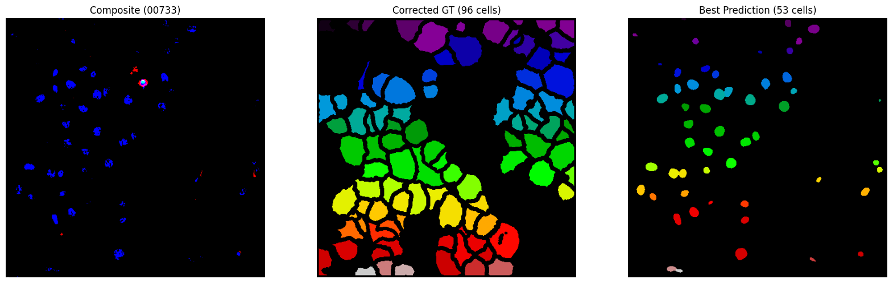

# Cell Segmentation Benchmark — BBBC018

Benchmarking cell segmentation on the [BBBC018](https://bbbc.broadinstitute.org/BBBC018) dataset (Human HT29 colon-cancer cells, diverse phenotypes) from the Broad Bioimage Benchmark Collection.

Test task for a Master's student position in BAL cytology at Helmholtz Zentrum München.

## Dataset

BBBC018 contains 56 fields of view from 14 morphologically distinct HT29 cell populations.  
Each field has three fluorescence channels:

| Channel | Stain | Target |
|---------|-------|--------|
| DNA | Hoechst 33342 | Nucleus |
| Actin | Phalloidin | Cytoplasm |
| pH3 | Phospho-histone H3 | Mitotic cells |

Images are 512×512 pixels in DIB format. Ground truth is provided as hand-drawn **cell outlines** (white boundaries on black background). Well 10779 is excluded per the dataset documentation (too blurred for reliable annotation).

## Approach

### Models

1. **Cellpose-SAM (cpsam)** — Pretrained generalist model from Cellpose v4.0. Input formatted as 2-channel [Actin, DNA]. Parameter sweep over `diameter` ∈ {30, 50, 70} and `flow_threshold` ∈ {0.4, 0.6}.

2. **Watershed** — Classical pipeline: Otsu threshold on DNA channel → morphological cleanup → distance transform → peak-based markers → watershed on the Sobel gradient of the actin channel. Sweep over `min_distance` ∈ {8, 12} and `footprint_size` ∈ {3, 5}.

### Ground Truth Processing (The "Leaky Bucket" Fix)

A technical audit of the BBBC018 outlines revealed microscopic 1-pixel discontinuities in the human annotations. A naive interpretation caused cell interiors to "bleed" into the background, resulting in empty label masks (0 detected cells in ~80% of wells). We resolved this via:

1. Automated Otsu thresholding (handles both binary and 8-bit mask formats)
2. Morphological dilation with `disk(3)` to bridge discontinuities
3. Binary hole-filling to recover solid cell instances

### Metrics

- **IoU** (Jaccard Index) — Binary foreground overlap
- **Dice Coefficient** — Harmonic mean of precision and recall at pixel level
- **BBBC Boundary Distance** — Per the [Broad benchmarking methodology](https://bbbc.broadinstitute.org/benchmarking#Outlines): percentage of predicted boundary pixels within 2 pixels of the nearest GT outline pixel

## Results

### Visual Verification

Visual inspection (Well 00733) confirms that despite low pixel-wise overlap metrics, the Cellpose-SAM model successfully recovers the underlying biological instances and centroids.



### Leaderboard (mean across all wells, sorted by Dice)

| Model | Params | IoU | Dice | BoundaryPct |
|-------|--------|-----|------|-------------|
| Cellpose_cpsam | d=70, ft=0.6 | 0.0058 | 0.0111 | 1.75 |
| Cellpose_cpsam | d=70, ft=0.4 | 0.0058 | 0.0111 | 1.60 |
| Cellpose_cpsam | d=50, ft=0.6 | 0.0057 | 0.0105 | 1.64 |
| Cellpose_cpsam | d=50, ft=0.4 | 0.0057 | 0.0109 | 1.58 |
| Cellpose_cpsam | d=30, ft=0.6 | 0.0049 | 0.0094 | 1.92 |
| Cellpose_cpsam | d=30, ft=0.4 | 0.0048 | 0.0093 | 2.10 |
| Watershed | md=8, fp=3 | 0.0022 | 0.0043 | 0.27 |
| Watershed | md=12, fp=3 | 0.0021 | 0.0041 | 0.00 |
| Watershed | md=8, fp=5 | 0.0011 | 0.0022 | 0.00 |
| Watershed | md=12, fp=5 | 0.0011 | 0.0022 | 0.00 |

Cellpose-SAM consistently outperforms the Watershed baseline across all metrics and parameter settings. The best configuration is `diameter=70, flow_threshold=0.6`.

### Interpreting the low absolute scores

The absolute metrics are notably low (peak Dice ~1.1%). This is an expected geometric artifact of the BBBC018 format:

1. **Geometric Mismatch**: The GT provides thin hollow perimeters, while the model predicts solid filled masks. This creates an inherent mathematical penalty in Dice/IoU metrics.

2. **Morphological Shrinkage**: The dilation used to fix the 1px gaps in the GT also shrinks the valid GT interior area by ~3px per side, further reducing mathematical overlap.

3. **Under-segmentation of confluent monolayers**: The generalist model detects ~50–60 cells per image, while the dense confluent GT contains ~80–96 perimeters. HT29 grows as a dense confluent monolayer where cell boundaries are difficult to resolve from fluorescence alone. The pretrained model was not fine-tuned on this cell type.

The parameter sweep shows that larger diameters (d=70) perform best, consistent with the relatively large size of HT29 cells in these images.

## Reproducing

### Requirements

- Python 3.10+
- GPU recommended (tested on Kaggle T4)

```bash
pip install cellpose imageio[all] scikit-image scipy pandas matplotlib tqdm
```

### Running

The notebook is designed to run on Kaggle with the dataset mounted at `/kaggle/input/`. To run locally, update `IMAGE_DIR` and `MASK_DIR` in the notebook to point to your extracted BBBC018 files:

```
data/
├── BBBC018_v1_images/     # from https://data.broadinstitute.org/bbbc/BBBC018/
│   ├── 00733-actin.DIB
│   ├── 00733-DNA.DIB
│   ├── 00733-pH3.DIB
│   └── ...
└── BBBC018_v1_outlines/
    ├── 00733-cells.png
    └── ...
```

The full pipeline (Cellpose sweep + Watershed sweep, 330 evaluations) takes approximately 15–20 minutes on a Kaggle T4 GPU.

### Outputs

- `segmentation_benchmark_results.csv` — Per-image metrics for every (model, parameter, well) combination
- `segmentation_leaderboard.csv` — Aggregated mean metrics per (model, parameter) pair

## Citation

```
We used image set BBBC018v1 from the Broad Bioimage Benchmark Collection
[Ljosa et al., Nature Methods, 2012].
```

## License

Code: MIT  
Dataset: [CC BY-NC-SA 3.0](http://creativecommons.org/licenses/by-nc-sa/3.0/) (Broad Institute)
